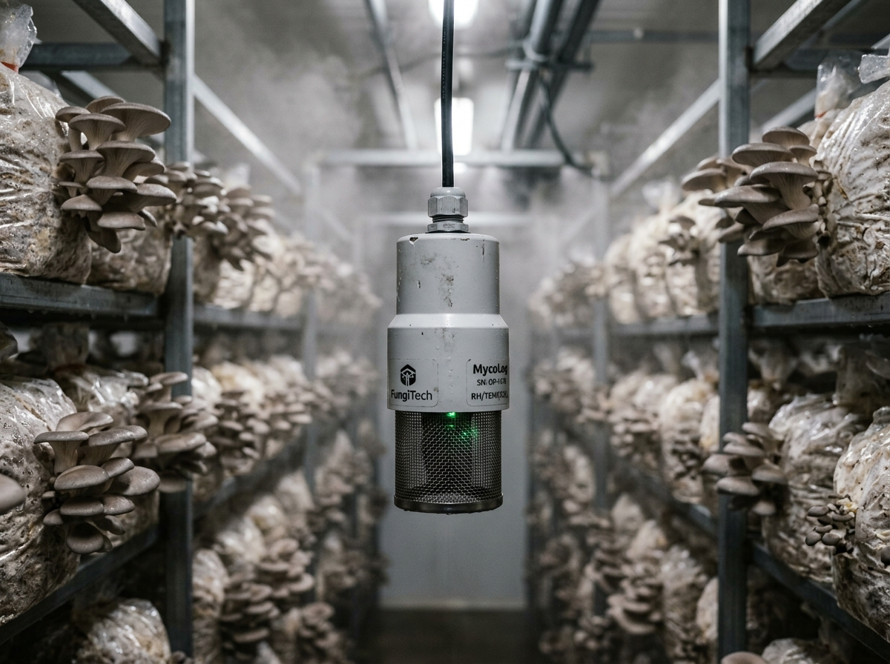

# Kabutech Hiyas — Plug-and-Play Grow House Implementation Plan

Transform the current sensor prototype into a universal plug-and-play automation system: **plug in power, connect the water line, and it runs.**

---

## 1. Executive Summary

| Aspect | Current Prototype | Production Target |
|---|---|---|
| **Form Factor** | Breadboard with loose jumper wires | Sealed IP65 industrial enclosure |
| **Actuator Control** | None (ESP32 only reads sensors) | 5-channel relay control (fans, misters, lights, valve) |
| **Sensors** | DHT11, LDR, MQ-135, resistive level | SHT31, BH1750, SCD41 (NDIR CO₂), capacitive level |
| **Sensor Protection**| Exposed directly to mist | Separated suspended probe, PTFE filter, louvered shield |
| **Connections** | Breadboard pins | Keyed GX16 aviation screw-lock connectors |
| **WiFi Setup** | Hardcoded in `.ino` source code | BLE / SoftAP mobile app setup wizard |
| **Autonomy** | Depends on cloud | Local PID control with offline resilience |

---

## 2. Remote Monitoring Architecture

The ESP32 and the mobile app communicate via Firebase Cloud Realtime Database. They do **not** need to be on the same WiFi network:

```
[ ESP32-S3 Controller ] ──(Grow House WiFi)──► [ Firebase RTDB ] ◄──(Mobile 4G/5G/WiFi)── [ User Mobile App ]
```

* **Global Access**: Monitor and control your grow house from anywhere in the world.
* **Low Latency**: State updates sync in real-time (~200–500ms).
* **Offline Fallback**: If internet drops, ESP32 continues autonomous climate control locally.

---

## 3. Hardware Architecture & Visual Design

### Grow House Installation Overview

*Figure 1: Wall-mounted IP65 controller box, overhead misting line, and canopy sensor probe suspended directly at mushroom bag height.*

### Controller Box Close-Up

*Figure 2: Sealed controller with OLED status display, status LEDs, rotary Auto/Manual mode switch, push-fit water fitting, and keyed GX16 aviation ports.*

### Connector Layout
* **[POWER IN]**: 220V AC mains with waterproof cable gland
* **[WATER IN / OUT]**: Quick-connect push-fit fitting (feeds misting line via internal 12V solenoid valve)
* **[FAN 1]**: GX16 4-Pin (Exhaust fan)
* **[FAN 2]**: GX16 4-Pin (Intake / Circulation fan)
* **[MISTER]**: GX16 4-Pin (High-pressure mist pump)
* **[LIGHT]**: GX16 4-Pin (Grow light LED strip)
* **[SENSOR PROBE]**: GX16 4-Pin (Shared I2C bus to external suspended probe)

---

## 4. Professional DIY Hanging Sensor Probe (The "PVC Bell Reducer Probe")

To ensure the hanging probe is compact, lightweight, and streamlined (rather than a bulky square box), the design uses a standard **2" to 1" PVC Bell Reducer** or conduit coupling. It looks like an industrial commercial sensor capsule, hangs unobtrusively between grow racks, and requires zero 3D printing.

### Hanging Probe Design Concept

*Figure 3: Compact suspended PVC bell probe hanging among mushroom grow bags, featuring a top IP68 cable gland and bottom breathable micro-mesh barrier.*

### The 10-Minute Build Steps
1. **The Bell Body**: Get a **2-inch to 1-inch PVC Reducer** (white or industrial gray). It stands only ~3.5 to 4 inches tall and weighs under 100 grams.
2. **Top Cable Gland (Suspension)**: Screw an **M16/M20 waterproof cable gland** into the 1-inch top opening. The gland grips the CAT5/CAT6 umbilical cable tightly, acting as both the water seal and the hanging anchor.
3. **Internal Sensor Mounting**: 
   - Solder/wire the DHT11, MQ-135, and LDR onto a small perfboard strip (or mount them back-to-back).
   - Slide the sensor assembly up inside the bell cavity.
4. **Bottom Micro-Mesh Screen**:
   - Cut a small circular piece of fine stainless steel or nylon mesh (window screen / fine filter mesh).
   - Secure it across the 2-inch bottom rim using PVC solvent or adhesive.
   - This prevents mist splashes from entering upward while allowing free ambient air circulation and CO₂ diffusion.

### Why this design excels for the Thesis Defense:
- **Streamlined & Compact**: Unlike a bulky square junction box, this slim cylindrical profile won't obstruct walkways or bump into fruiting mushroom bags.
- **Natural Umbrella Shielding**: The bell's solid dome naturally sheds water droplets falling from overhead misting nozzles.
- **Commercial Polish**: With a clean printed label (e.g., "KABUTECH HIYAS - Environmental Probe SN-01"), it looks indistinguishable from commercial greenhouse sensors costing thousands of pesos.
- **Ultra-Low Cost**: Built entirely with ~₱60–₱100 worth of standard plumbing/electrical parts available at any hardware store.

> [!TIP]
> **Thesis Defense Script**
> *"We engineered a streamlined, suspended cylindrical sensor capsule using a modified industrial PVC reducer. The upper conical geometry naturally deflects falling mist condensation, while the bottom aperture features a hydrophobic micro-mesh barrier that facilitates unhindered gaseous exchange for precise CO₂ and humidity monitoring without risking water pooling on sensor electronics."*

---

## 5. Firmware Control & Safety Architecture

### Core Modules Needed
1. **Actuator Driver**: Reads Firebase `settings/setpoints/devices/*` and switches corresponding relay pins.
2. **Autonomous PID / Hysteresis Controller**: Maintains humidity (85–95%), temperature (22–26°C), and CO₂ (<1000ppm) locally on the ESP32.
3. **Smart Mister Pause**: When misters fire, temporarily freeze sensor sampling for 45 seconds to avoid mist-bias readings.
4. **Fail-Safe Watchdog**: If ESP32 crashes or sensor disconnects, default fans ON, misters OFF, and send Firebase alert.
5. **BLE / SoftAP Provisioning**: Allows growers to pair device to home WiFi without editing code.

---

## 6. Universal Grow House Adaptability

### Preset Crop Profiles
| Parameter | Oyster Mushroom | Shiitake | Lion's Mane |
|---|---|---|---|
| **Temperature** | 20–28°C | 15–21°C | 18–24°C |
| **Relative Humidity** | 85–95% | 80–90% | 85–95% |
| **CO₂ Concentration** | < 1000 ppm | < 1000 ppm | < 800 ppm |
| **Light Level** | 500–1000 lux | 500–1000 lux | 500–800 lux |
| **Air Exchange** | High | Medium | High |

### First-Boot Auto-Calibration
When installed in a new grow house, the system runs an automatic 10-minute diagnostic:
1. Measures room baseline climate.
2. Pulses exhaust fan to measure air evacuation rate (calculates room volume).
3. Pulses mister to measure humidity rise rate.
4. Calibrates PID response curves specific to the grower's room size.

---

## 7. Firebase Realtime Database Schema

```json
{
  "kabutech": {
    "sensors": {
      "live": {
        "temperature": 24.5,
        "humidity": 89.2,
        "light": 720,
        "co2": 850,
        "waterLevel": 85,
        "waterFlow": 1.2,
        "esp32_status": "ONLINE"
      }
    },
    "settings": {
      "setpoints": {
        "temperature": 24.0,
        "humidity": 90.0,
        "light": 800,
        "co2": 900,
        "mode": "auto",
        "devices": {
          "fans": false,
          "misters": true,
          "lights": true,
          "waterValve": false
        }
      }
    },
    "device": {
      "firmwareVersion": "2.0.0",
      "wifiSignal": -58,
      "uptime": 86400,
      "lastSeen": 1726115000
    }
  }
}
```

---

## 8. Bill of Materials (BOM Estimate)

| Category | Component | Est. Price (PHP) |
|---|---|---|
| **Sensors & Probe** | SHT31 Temp/Humidity Module | ₱180–280 |
| | BH1750 Ambient Light Sensor | ₱50–80 |
| | SCD41 True NDIR CO₂ Sensor | ₱2,500–3,200 |
| | Capacitive Water Level Sensor | ₱150–250 |
| | YF-S201 Water Flow Sensor | ₱150–200 |
| **Probe Housing** | Louvered Radiation Shield + PVC caps | ₱210–450 |
| | PTFE Membrane Disc + Cable Gland (PG7) | ₱55–110 |
| | 4-Core Shielded Cable (2m) | ₱100–180 |
| **Controller Box** | ESP32-S3 DevKit N16R8 | ₱350–500 |
| | 5-Channel Relay Module (Optocoupled) | ₱200–350 |
| | 12V 5A Mean Well Enclosed Power Supply | ₱400–600 |
| | 12V Solenoid Valve (¾" normally closed) | ₱250–400 |
| | IP65 Waterproof Enclosure Box | ₱300–500 |
| | GX16 Aviation Connectors (6 sets) | ₱600–900 |
| | Custom PCB / Wiring / Terminals / Fuses | ₱400–700 |
| **Total Est. Cost** | | **₱5,995–8,900** |

---

## 9. Implementation Roadmap

```
[Phase 1: Actuator Firmware] ──► [Phase 2: WiFi Provisioning] ──► [Phase 3: Auto Mode & PID]
                                                                          │
[Phase 6: Multi-Device & OTA] ◄── [Phase 5: PCB & Enclosure]   ◄── [Phase 4: Sensor Upgrade]
```

* **Phase 1 (Week 1–2)**: Implement relay controls in `kabutech_prototype.ino` listening to Firebase toggles.
* **Phase 2 (Week 3)**: Replace hardcoded WiFi with Bluetooth / SoftAP provisioning wizard in mobile app.
* **Phase 3 (Week 4–5)**: Implement local autonomous control loops on ESP32 (independent of internet).
* **Phase 4 (Week 6)**: Integrate SHT31, BH1750, and SCD41 on shared I2C bus.
* **Phase 5 (Week 7–9)**: Design custom PCB and assemble IP65 controller with aviation ports.
* **Phase 6 (Week 10+)**: Add Over-The-Air (OTA) firmware updates and multi-room management.

---

## 10. Open Decisions for Implementation

1. **Actuator Voltage**: 220V AC (standard Philippine fans/pumps) vs 12V DC (extra safe for initial batch).
2. **CO₂ Sensor Tier**: Adopt SCD41 directly (₱2,800) or keep MQ-135 as an entry-level "Air Index" option.
3. **Water Supply**: Main line auto-fill solenoid vs reservoir feed pump.
