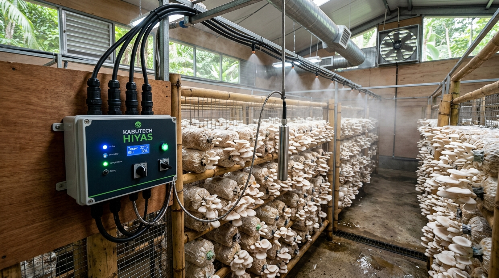
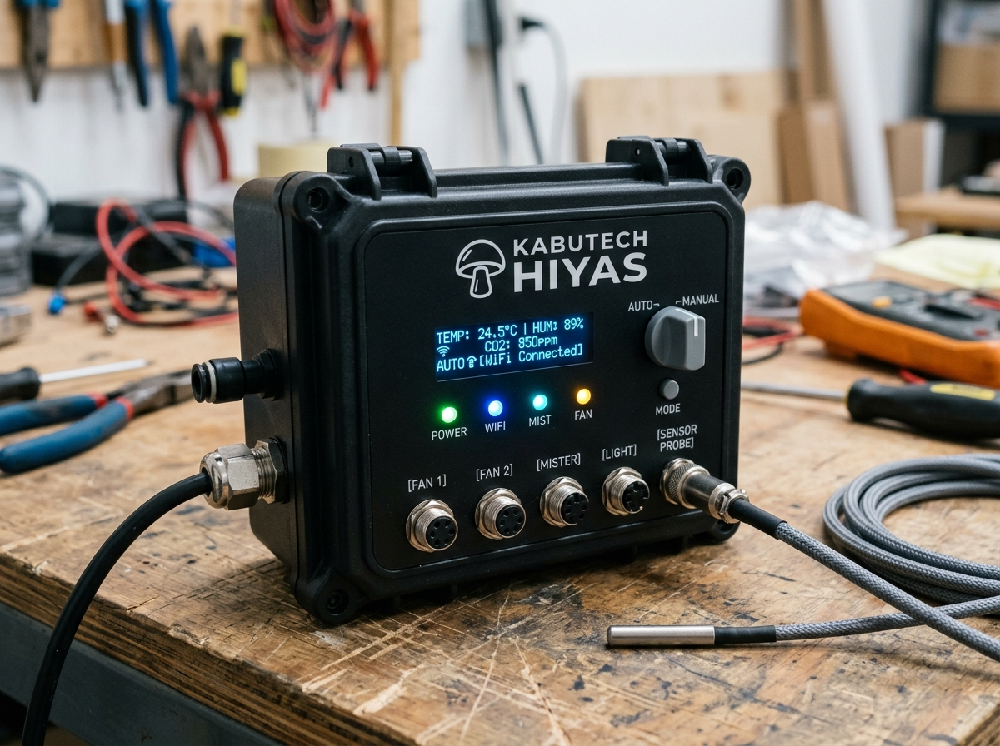
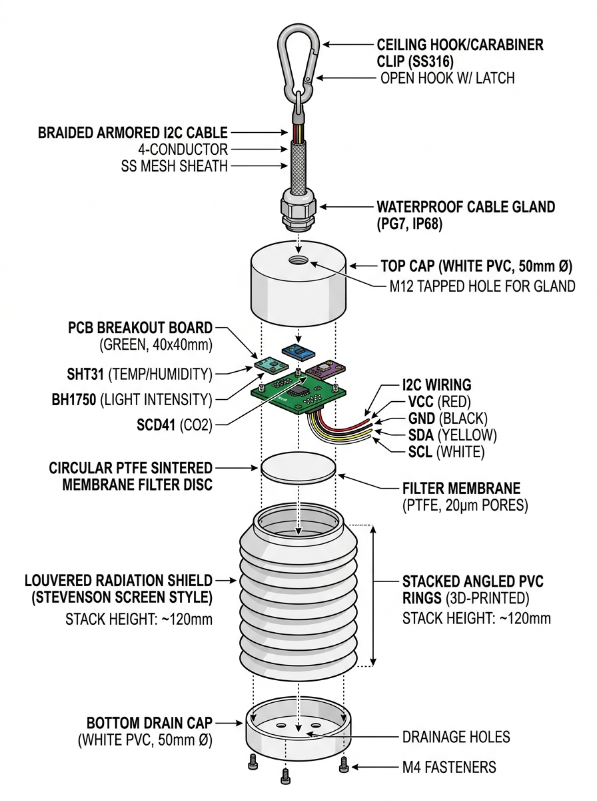

# Kabutech Hiyas — Plug-and-Play Grow House Implementation Plan

Transform the current sensor prototype into a universal plug-and-play automation system: **plug in power, connect the water line, and it runs.**

---

## 1. Executive Summary

| Aspect | Current Prototype | Production Target |
|---|---|---|
| **Form Factor** | Breadboard with loose jumper wires | Sealed IP65 industrial enclosure |
| **Actuator Control** | None (ESP32 only reads sensors) | 5-channel relay control (fans, misters, lights, valve) |
| **Sensors** | DHT11, LDR, MQ-135, resistive level | SHT31, BH1750, SCD41 (NDIR CO₂), capacitive level |
| **Sensor Protection**| Exposed directly to mist | Separated suspended probe, PTFE filter, louvered shield |
| **Connections** | Breadboard pins | Keyed GX16 aviation screw-lock connectors |
| **WiFi Setup** | Hardcoded in `.ino` source code | BLE / SoftAP mobile app setup wizard |
| **Autonomy** | Depends on cloud | Local PID control with offline resilience |

---

## 2. Remote Monitoring Architecture

The ESP32 and the mobile app communicate via Firebase Cloud Realtime Database. They do **not** need to be on the same WiFi network:

```
[ ESP32-S3 Controller ] ──(Grow House WiFi)──► [ Firebase RTDB ] ◄──(Mobile 4G/5G/WiFi)── [ User Mobile App ]
```

* **Global Access**: Monitor and control your grow house from anywhere in the world.
* **Low Latency**: State updates sync in real-time (~200–500ms).
* **Offline Fallback**: If internet drops, ESP32 continues autonomous climate control locally.

---

## 3. Hardware Architecture & Visual Design

### Grow House Installation Overview

*Figure 1: Wall-mounted IP65 controller box, overhead misting line, and canopy sensor probe suspended directly at mushroom bag height.*

### Controller Box Close-Up

*Figure 2: Sealed controller with OLED status display, status LEDs, rotary Auto/Manual mode switch, push-fit water fitting, and keyed GX16 aviation ports.*

### Connector Layout
* **[POWER IN]**: 220V AC mains with waterproof cable gland
* **[WATER IN / OUT]**: Quick-connect push-fit fitting (feeds misting line via internal 12V solenoid valve)
* **[FAN 1]**: GX16 4-Pin (Exhaust fan)
* **[FAN 2]**: GX16 4-Pin (Intake / Circulation fan)
* **[MISTER]**: GX16 4-Pin (High-pressure mist pump)
* **[LIGHT]**: GX16 4-Pin (Grow light LED strip)
* **[SENSOR PROBE]**: GX16 4-Pin (Shared I2C bus to external suspended probe)

---

## 4. Canopy Sensor Probe Fabrication Guide


*Figure 3: Technical exploded view of the waterproof canopy sensor probe assembly.*

### 4-Layer Moisture Defense System
1. **Physical Separation**: Probe hangs at canopy height (1–3m away from wall controller box).
2. **Louvered Weather Shield**: Angled louvers deflect direct high-pressure mist droplets while allowing natural airflow.
3. **PTFE Sintered Membrane (20µm)**: Allows humidity vapor and CO₂ gases to pass freely while completely blocking liquid water droplets.
4. **Conformal Coating**: Silicone conformal resin seals PCB traces and solder joints against internal condensation.

### Electrical Wiring (Shared 4-Wire I2C Bus)
All three canopy sensors communicate over I2C, requiring only 4 conductors:

| Wire Color | GX16 Pin | Signal | Destination |
|---|---|---|---|
| **Red** | Pin 1 | 3.3V VCC | VCC on SHT31, BH1750, SCD41 |
| **Black** | Pin 2 | GND | GND on all 3 sensors |
| **Yellow** | Pin 3 | SDA | GPIO 8 on ESP32 + 4.7kΩ pull-up |
| **White** | Pin 4 | SCL | GPIO 9 on ESP32 + 4.7kΩ pull-up |

> **I2C Addresses (Zero Conflict):**
> * SHT31 (Temp/Humidity): `0x44`
> * BH1750 (Light): `0x23`
> * SCD41 (CO₂): `0x62`

### Step-by-Step Probe Assembly
1. **Cap Preparation**: Drill a 12mm hole in a 50mm PVC top cap for the PG7 cable gland and stainless carabiner hook. Drill three 2.5mm weep holes in the bottom cap for gravity drainage.
2. **Carrier Board**: Solder SHT31, BH1750, and SCD41 on a 35mm perfboard. Wire VCC, GND, SDA, and SCL in parallel with two 4.7kΩ pull-up resistors.
3. **Conformal Coating**: Mask the sensor sensing apertures with tape, spray 2 coats of silicone conformal coating over all solder joints and traces, cure for 30 minutes, and remove tape.
4. **PTFE Filter**: Install the 20µm sintered PTFE membrane disc over the sensor window with neutral-cure RTV silicone.
5. **Housing Integration**: Slide carrier into the louvered shield, tighten the PG7 cable gland, and secure end caps.
6. **Connector Termination**: Solder the 4-core cable to the GX16 male aviation plug with heat shrink tubing on each pin.

---

## 5. Firmware Control & Safety Architecture

### Core Modules Needed
1. **Actuator Driver**: Reads Firebase `settings/setpoints/devices/*` and switches corresponding relay pins.
2. **Autonomous PID / Hysteresis Controller**: Maintains humidity (85–95%), temperature (22–26°C), and CO₂ (<1000ppm) locally on the ESP32.
3. **Smart Mister Pause**: When misters fire, temporarily freeze sensor sampling for 45 seconds to avoid mist-bias readings.
4. **Fail-Safe Watchdog**: If ESP32 crashes or sensor disconnects, default fans ON, misters OFF, and send Firebase alert.
5. **BLE / SoftAP Provisioning**: Allows growers to pair device to home WiFi without editing code.

---

## 6. Universal Grow House Adaptability

### Preset Crop Profiles
| Parameter | Oyster Mushroom | Shiitake | Lion's Mane |
|---|---|---|---|
| **Temperature** | 20–28°C | 15–21°C | 18–24°C |
| **Relative Humidity** | 85–95% | 80–90% | 85–95% |
| **CO₂ Concentration** | < 1000 ppm | < 1000 ppm | < 800 ppm |
| **Light Level** | 500–1000 lux | 500–1000 lux | 500–800 lux |
| **Air Exchange** | High | Medium | High |

### First-Boot Auto-Calibration
When installed in a new grow house, the system runs an automatic 10-minute diagnostic:
1. Measures room baseline climate.
2. Pulses exhaust fan to measure air evacuation rate (calculates room volume).
3. Pulses mister to measure humidity rise rate.
4. Calibrates PID response curves specific to the grower's room size.

---

## 7. Firebase Realtime Database Schema

```json
{
  "kabutech": {
    "sensors": {
      "live": {
        "temperature": 24.5,
        "humidity": 89.2,
        "light": 720,
        "co2": 850,
        "waterLevel": 85,
        "waterFlow": 1.2,
        "esp32_status": "ONLINE"
      }
    },
    "settings": {
      "setpoints": {
        "temperature": 24.0,
        "humidity": 90.0,
        "light": 800,
        "co2": 900,
        "mode": "auto",
        "devices": {
          "fans": false,
          "misters": true,
          "lights": true,
          "waterValve": false
        }
      }
    },
    "device": {
      "firmwareVersion": "2.0.0",
      "wifiSignal": -58,
      "uptime": 86400,
      "lastSeen": 1726115000
    }
  }
}
```

---

## 8. Bill of Materials (BOM Estimate)

| Category | Component | Est. Price (PHP) |
|---|---|---|
| **Sensors & Probe** | SHT31 Temp/Humidity Module | ₱180–280 |
| | BH1750 Ambient Light Sensor | ₱50–80 |
| | SCD41 True NDIR CO₂ Sensor | ₱2,500–3,200 |
| | Capacitive Water Level Sensor | ₱150–250 |
| | YF-S201 Water Flow Sensor | ₱150–200 |
| **Probe Housing** | Louvered Radiation Shield + PVC caps | ₱210–450 |
| | PTFE Membrane Disc + Cable Gland (PG7) | ₱55–110 |
| | 4-Core Shielded Cable (2m) | ₱100–180 |
| **Controller Box** | ESP32-S3 DevKit N16R8 | ₱350–500 |
| | 5-Channel Relay Module (Optocoupled) | ₱200–350 |
| | 12V 5A Mean Well Enclosed Power Supply | ₱400–600 |
| | 12V Solenoid Valve (¾" normally closed) | ₱250–400 |
| | IP65 Waterproof Enclosure Box | ₱300–500 |
| | GX16 Aviation Connectors (6 sets) | ₱600–900 |
| | Custom PCB / Wiring / Terminals / Fuses | ₱400–700 |
| **Total Est. Cost** | | **₱5,995–8,900** |

---

## 9. Implementation Roadmap

```
[Phase 1: Actuator Firmware] ──► [Phase 2: WiFi Provisioning] ──► [Phase 3: Auto Mode & PID]
                                                                          │
[Phase 6: Multi-Device & OTA] ◄── [Phase 5: PCB & Enclosure]   ◄── [Phase 4: Sensor Upgrade]
```

* **Phase 1 (Week 1–2)**: Implement relay controls in `kabutech_prototype.ino` listening to Firebase toggles.
* **Phase 2 (Week 3)**: Replace hardcoded WiFi with Bluetooth / SoftAP provisioning wizard in mobile app.
* **Phase 3 (Week 4–5)**: Implement local autonomous control loops on ESP32 (independent of internet).
* **Phase 4 (Week 6)**: Integrate SHT31, BH1750, and SCD41 on shared I2C bus.
* **Phase 5 (Week 7–9)**: Design custom PCB and assemble IP65 controller with aviation ports.
* **Phase 6 (Week 10+)**: Add Over-The-Air (OTA) firmware updates and multi-room management.

---

## 10. Open Decisions for Implementation

1. **Actuator Voltage**: 220V AC (standard Philippine fans/pumps) vs 12V DC (extra safe for initial batch).
2. **CO₂ Sensor Tier**: Adopt SCD41 directly (₱2,800) or keep MQ-135 as an entry-level "Air Index" option.
3. **Water Supply**: Main line auto-fill solenoid vs reservoir feed pump.
