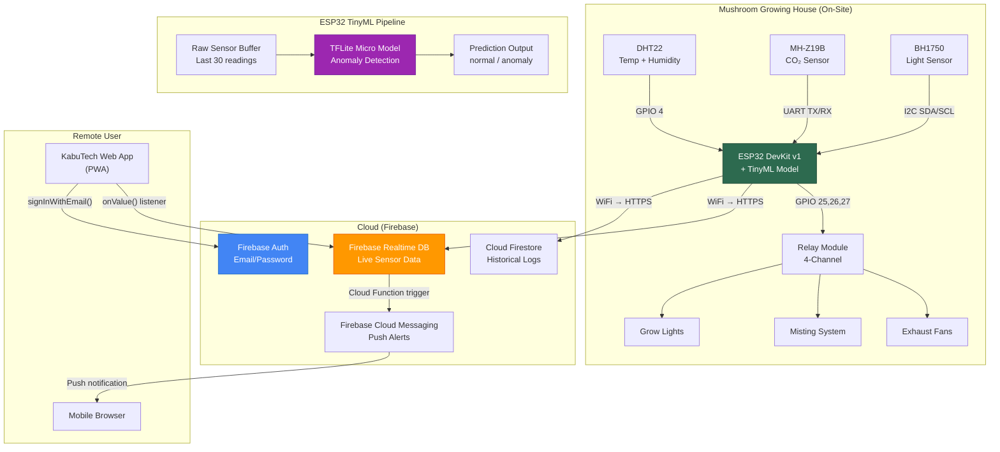
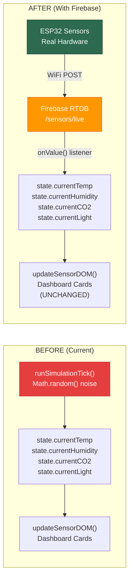

# KabuTech IoT Backend & ESP32 Integration Plan

## Problem Statement

The KabuTech Hiyas web app currently displays **simulated sensor data** generated by a JavaScript `runSimulationTick()` engine ([app.js:L2265](file:///home/zandro/Downloads/KabuTech%20App%20v4/js/app.js#L2265)). Temperature, humidity, CO₂, and light values are produced by drift cycles with random noise — no real sensors or backend exist.

The goal is to make the app usable in **remote farming locations** by connecting real ESP32 hardware sensors to Firebase, enabling farmers to monitor their mushroom growing house from anywhere with an internet connection.

---

## System Architecture



---

## Component Breakdown

### Phase 1: Firebase Backend Setup

#### 1.1 Firebase Project Configuration

| Service | Purpose | Plan |
|---|---|---|
| **Firebase Auth** | User login/signup | Email + Password (replaces localStorage auth) |
| **Realtime Database** | Live sensor readings | Low-latency, real-time sync to web app |
| **Cloud Firestore** | Historical data & logs | Time-series storage for charts/reports |
| **Cloud Functions** | Alert triggers | Push notifications when thresholds exceeded |
| **Cloud Messaging** | Push alerts | Notify remote farmers of critical conditions |

#### 1.2 Realtime Database Schema

```json
{
  "kabutech": {
    "sensors": {
      "live": {
        "temperature": 24.2,
        "humidity": 68.0,
        "co2": 420,
        "light": 420,
        "timestamp": 1720648800000,
        "esp32_status": "online",
        "wifi_rssi": -45
      },
      "tinyml": {
        "anomaly_detected": false,
        "anomaly_type": "none",
        "confidence": 0.95,
        "last_inference_ms": 12
      }
    },
    "controls": {
      "mode": "auto",
      "fans": { "state": true, "setBy": "auto", "timestamp": 1720648800000 },
      "misters": { "state": false, "setBy": "manual", "timestamp": 1720648700000 },
      "lights": { "state": false, "setBy": "auto", "timestamp": 1720648600000 }
    },
    "setpoints": {
      "temperature": 23.5,
      "humidity": 75.0,
      "light": 500,
      "co2": 600
    },
    "history": {
      "2026-07-10": {
        "readings": {
          "-NxYz123": { "temp": 24.1, "hum": 67, "co2": 430, "light": 415, "ts": 1720648800000 }
        }
      }
    }
  }
}
```

#### 1.3 Realtime Database Security Rules

```json
{
  "rules": {
    "kabutech": {
      "sensors": {
        ".read": "auth != null",
        ".write": "auth != null && auth.token.role === 'esp32'"
      },
      "controls": {
        ".read": "auth != null",
        ".write": "auth != null && (auth.token.role === 'admin' || auth.token.role === 'esp32')"
      },
      "setpoints": {
        ".read": "auth != null",
        ".write": "auth != null && auth.token.role === 'admin'"
      },
      "history": {
        ".read": "auth != null",
        ".write": "auth != null && auth.token.role === 'esp32'"
      }
    }
  }
}
```

---

### Phase 2: ESP32 Hardware & Firmware

#### 2.1 Bill of Materials (BOM)

| # | Component | Model | Qty | Purpose | Est. Cost (PHP) |
|---|---|---|---|---|---|
| 1 | Microcontroller | ESP32 DevKit V1 (30-pin) | 1 | Main MCU + WiFi | ₱350 |
| 2 | Temp/Humidity | DHT22 (AM2302) | 1 | Temperature + Humidity | ₱180 |
| 3 | CO₂ Sensor | MH-Z19B (NDIR) | 1 | CO₂ concentration (ppm) | ₱1,200 |
| 4 | Light Sensor | BH1750 (I2C) | 1 | Lux → µmol conversion | ₱85 |
| 5 | Relay Module | 4-Channel 5V Opto-Isolated | 1 | Fan/Mister/Light control | ₱150 |
| 6 | Power Supply | 5V 3A USB-C adapter | 1 | ESP32 + sensor power | ₱200 |
| 7 | Jumper Wires | Male-Female, 20cm | 20 | Connections | ₱50 |
| 8 | Breadboard | 830-point (or PCB) | 1 | Prototyping | ₱80 |
| 9 | Enclosure | IP65 waterproof box | 1 | Mushroom house protection | ₱250 |
| | | | | **Total** | **≈ ₱2,545** |

#### 2.2 Wiring Diagram

```
ESP32 DevKit V1 Pin Assignments
═══════════════════════════════════════════════════

DHT22 (Temperature + Humidity)
├── VCC  → 3.3V
├── DATA → GPIO 4 (with 10kΩ pull-up to 3.3V)
└── GND  → GND

MH-Z19B (CO₂ Sensor - UART)
├── VCC  → 5V (Vin pin)
├── GND  → GND
├── TX   → GPIO 16 (ESP32 RX2)
└── RX   → GPIO 17 (ESP32 TX2)

BH1750 (Light Sensor - I2C)
├── VCC  → 3.3V
├── GND  → GND
├── SDA  → GPIO 21
├── SCL  → GPIO 22
└── ADDR → GND (address 0x23)

4-Channel Relay Module
├── VCC  → 5V (Vin)
├── GND  → GND
├── IN1  → GPIO 25 (Fans)
├── IN2  → GPIO 26 (Misters)
├── IN3  → GPIO 27 (Lights)
└── IN4  → (spare)
```

#### 2.3 ESP32 Firmware Overview

The firmware will be written in **Arduino C++** using PlatformIO or Arduino IDE.

**Core responsibilities:**
1. Read sensors every **10 seconds**
2. Push live readings to Firebase RTDB `/kabutech/sensors/live`
3. Push historical snapshots every **5 minutes** to `/kabutech/history/{date}/readings`
4. Listen for control commands from `/kabutech/controls/` (fan/mister/light toggle)
5. Run TinyML inference every **30 seconds** on a rolling window of readings
6. Report TinyML predictions to `/kabutech/sensors/tinyml`

**Key libraries:**
- `Firebase_ESP32` by Mobizt — Firebase RTDB + Auth
- `DHT` by Adafruit — DHT22 sensor
- `MHZ19` by Jonathan Dempsey — CO₂ sensor
- `BH1750` by Christopher Laws — Light sensor
- `TensorFlowLite_ESP32` — TFLite Micro for anomaly detection

---

### Phase 3: TinyML Integration (Innovation Layer)

#### 3.1 What TinyML Does Here

Instead of just sending raw sensor data and relying on hard-coded thresholds, the ESP32 runs a **trained machine learning model** directly on the microcontroller to detect **anomalous environmental patterns** that simple thresholds would miss.

| Feature | Threshold Approach | TinyML Approach |
|---|---|---|
| High temp detection | `if (temp > 32)` alert | Detects unusual **rate of change** patterns |
| Equipment failure | Can't detect | Recognizes sensor patterns of fan/mister failure |
| Multi-sensor correlation | Each sensor independent | Detects when temp↑ + humidity↓ + CO₂↑ together |
| False positive rate | High (noisy readings trigger alerts) | Low (model trained on real patterns) |
| Predictive capability | None | Can warn **before** conditions become critical |

#### 3.2 TinyML Model Design

```
Model: Autoencoder Anomaly Detector
═══════════════════════════════════

Input:  [30 × 4] = 120 features
        (Last 30 readings × 4 sensors: temp, humidity, co2, light)
        Normalized to [0, 1] range

Architecture:
        Input(120) → Dense(64, ReLU) → Dense(16, ReLU) → Dense(64, ReLU) → Output(120, Sigmoid)
        
        Latent space = 16 dimensions (compressed representation of "normal")

Detection:
        reconstruction_error = MSE(input, output)
        if reconstruction_error > threshold → ANOMALY DETECTED

Model Size: ~15 KB (quantized INT8)
Inference Time: ~12ms on ESP32 @ 240MHz
RAM Usage: ~35 KB during inference
```

#### 3.3 Training Pipeline

1. **Collect normal data**: Run ESP32 for 2-4 weeks collecting readings every 10s
2. **Train autoencoder**: Python script using TensorFlow/Keras on collected CSV data
3. **Convert to TFLite**: Quantize to INT8, export as C byte array
4. **Flash to ESP32**: Include model as header file in firmware
5. **Continuous improvement**: Periodically retrain with new normal data

> [!IMPORTANT]
> For initial deployment, we'll ship a **pre-trained model** using synthetic data that mimics mushroom house conditions. Once the system collects 2+ weeks of real data, retrain with actual readings for much better accuracy.

---

### Phase 4: Web App Modifications

#### 4.1 Files to Modify

##### [MODIFY] [index.html](file:///home/zandro/Downloads/KabuTech%20App%20v4/index.html)
- Add Firebase SDK scripts (v9 modular, loaded via CDN)
- Add connection status indicator (online/offline badge)

##### [MODIFY] [app.js](file:///home/zandro/Downloads/KabuTech%20App%20v4/js/app.js)
- **Replace** `handleLogin()` / `handleRegister()` with Firebase Auth calls
- **Replace** `runSimulationTick()` simulation engine with Firebase `onValue()` listeners
- **Add** new `firebase-config.js` module for Firebase initialization
- **Add** `onValue()` listener on `/kabutech/sensors/live` → updates `state.currentTemp`, etc.
- **Add** `onValue()` listener on `/kabutech/controls/` → syncs device toggle states
- **Add** write functions for control toggles → `set()` on `/kabutech/controls/fans/state`
- **Keep** `updateSensorDOM()`, `updateSensorCardStatus()`, sparklines, alerts — they read from `state.*` which we'll populate from Firebase instead of simulation
- **Add** fallback: if Firebase disconnects, show "Offline" badge and freeze last-known readings
- **Add** TinyML prediction display: show anomaly badge on dashboard when `tinyml.anomaly_detected === true`

##### [NEW] [js/firebase-config.js](file:///home/zandro/Downloads/KabuTech%20App%20v4/js/firebase-config.js)
- Firebase app initialization
- Auth, RTDB, Firestore module exports
- Connection state monitoring (`onDisconnect`, `.info/connected`)

##### [NEW] [esp32/](file:///home/zandro/Downloads/KabuTech%20App%20v4/esp32/)
- `esp32/kabutech_firmware/kabutech_firmware.ino` — Main Arduino sketch
- `esp32/kabutech_firmware/config.h` — WiFi credentials, Firebase keys
- `esp32/kabutech_firmware/tinyml_model.h` — Quantized TFLite model as C array
- `esp32/training/train_anomaly_model.py` — Python training script
- `esp32/training/generate_synthetic_data.py` — Synthetic data generator
- `esp32/training/convert_to_tflite.py` — Model conversion + quantization

#### 4.2 Data Flow Change



> [!TIP]
> The beauty of this design is that the **entire existing UI code remains unchanged**. We only replace the data source (simulation → Firebase). The `updateSensorDOM()`, `updateSensorCardStatus()`, sparklines, alerts — all continue working because they read from `state.*` variables.

---

### Phase 5: Offline & Fallback Strategy

| Scenario | Behavior |
|---|---|
| ESP32 has WiFi | Normal operation — reads sensors, pushes to Firebase every 10s |
| ESP32 loses WiFi | Buffers up to 100 readings locally (SPIFFS), auto-retries every 30s, pushes backlog when reconnected |
| Web app online | Real-time listener updates dashboard instantly |
| Web app offline (PWA cached) | Shows last-known readings with "Offline" badge, service worker serves cached app shell |
| Firebase down | ESP32 retries with exponential backoff; web app shows stale data with timestamp |

---

## User Review Required

> [!IMPORTANT]
> **Firebase Project**: You'll need a Google account to create a Firebase project at [console.firebase.google.com](https://console.firebase.google.com). The free Spark plan supports up to **100 simultaneous RTDB connections** and **1 GB storage** — more than enough for this use case. Do you already have a Firebase project, or should I guide you through creating one?

> [!IMPORTANT]
> **WiFi at the Farm**: The ESP32 needs WiFi/internet to send data to Firebase. Do you have a WiFi router at the mushroom growing house? If connectivity is intermittent, the offline buffering strategy (Phase 5) handles that, but you need *some* connectivity.

> [!WARNING]
> **Hardware Purchase**: The BOM totals ≈ ₱2,545. The MH-Z19B CO₂ sensor is the most expensive component (₱1,200). A cheaper alternative is the MQ-135 (₱120) but it's far less accurate for CO₂. Which do you prefer?

## Open Questions

1. **Which ESP32 board do you have?** — DevKit V1 (30-pin) is most common. If you have a different variant (S2, S3, C3), pin assignments will change.
2. **Do you want the TinyML model to also predict optimal harvest timing?** — This would require a second model trained on harvest data. We can add it later.
3. **Cloud Functions for push notifications** — This requires the Firebase Blaze (pay-as-you-go) plan. Do you want push alerts, or is the in-app alert system sufficient?
4. **Should the ESP32 also control actuators (fans, misters, lights) via relay?** — The plan includes this, but if you only want monitoring (no control), we can simplify.

---

## Verification Plan

### Automated Tests
1. ESP32 firmware compiles with `platformio run` (or Arduino IDE verify)
2. Firebase RTDB rules tested with Firebase Emulator Suite
3. Web app loads with Firebase SDK — check browser console for auth + listener success
4. TinyML model inference tested on ESP32 serial monitor (prints predictions)

### Hardware Integration Test
1. Connect DHT22 only → verify temp/humidity appear in Firebase console
2. Add MH-Z19B → verify CO₂ readings
3. Add BH1750 → verify light readings
4. Toggle relay from web app → verify physical relay clicks
5. Disconnect WiFi → verify buffer + reconnection behavior

### End-to-End Test
1. Change temperature (blow hot air on DHT22) → see web app update within 2s
2. Cover BH1750 → see light value drop on dashboard
3. Trigger TinyML anomaly (rapid temp change) → see anomaly badge appear
4. Login from phone browser over mobile data → verify remote access works

---

## Execution Order

| Step | Phase | What | Time Estimate |
|---|---|---|---|
| 1 | Firebase Setup | Create project, enable Auth + RTDB, set rules | 30 min |
| 2 | Web App Firebase Config | Add SDK, create `firebase-config.js` | 1 hour |
| 3 | Web App Auth | Replace localStorage auth with Firebase Auth | 2 hours |
| 4 | ESP32 Firmware (Sensors Only) | Read DHT22 + MH-Z19B + BH1750, push to Firebase | 3 hours |
| 5 | Web App Live Data | Replace simulation with `onValue()` listeners | 2 hours |
| 6 | ESP32 Control Listener | Listen for fan/mister/light commands from RTDB | 1 hour |
| 7 | Web App Control Writes | Toggle buttons write to Firebase instead of local state | 1 hour |
| 8 | TinyML Training Pipeline | Generate data, train model, convert to TFLite | 3 hours |
| 9 | TinyML on ESP32 | Integrate model inference into firmware | 2 hours |
| 10 | Web App TinyML Display | Show anomaly predictions on dashboard | 1 hour |
| 11 | Offline Handling | SPIFFS buffer on ESP32, PWA offline badge | 2 hours |
| 12 | Testing & Polish | End-to-end testing, bug fixes | 2 hours |
| | | **Total** | **~20 hours** |
